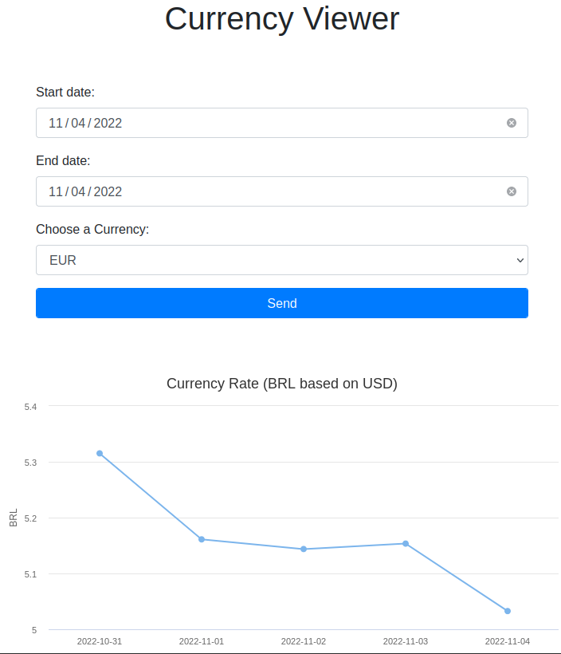
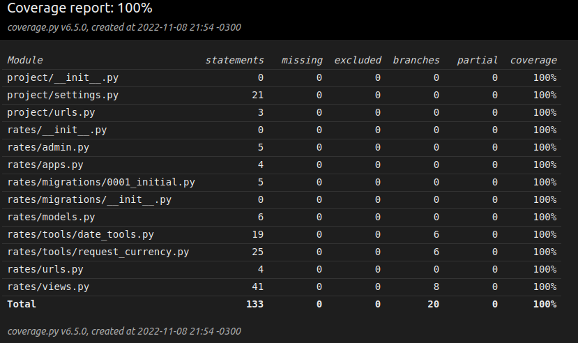

# Currency Viewer

This application graphs a series of exchange rate of the BRL, EUR and JPY currencies based on dollar and stores them in a database for future requests.

Everything is developed on Django and it uses a highcharts graph to visualize the rates.

The source data is collected from:
```
https://www.vatcomply.com/documentation 
```

When a date range is requested to API, the currency rates are stored in the database.

The image below shows a preview:



Attention: You can only request a range of 5 business days!

This application has 100% tests coverage.



It also has an API endpoint to show all dates and rates stored in db, callable with GET by:
```
 /api/v1/
```

## How to run

### On local

You can follow the requirements and run by yourself or just run in Docker:
```
docker-compose up -d --build
```

### On prod

You can also run it on a production enviroment, following these steps:

 - Build the image and run the container
```
docker-compose -f docker-compose.prod.yml up -d --build
```

 - Collect static files
```
docker-compose -f docker-compose.prod.yml exec web python manage.py collectstatic --no-input --clear
```

Note: on production mode, docker runs this project with DEBUG=False

